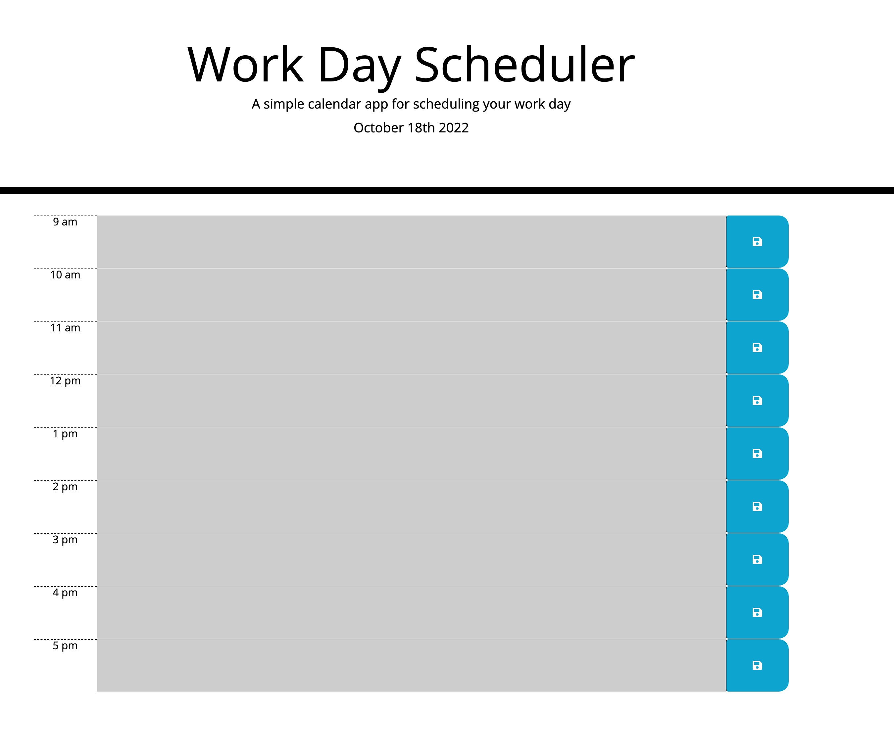

# Module 5 Challenge: Work Day Scheduler

## Description

A calendar app that allows a user to input and save events for each hour of the work day. The schedule is color coded based on the current time.

## Repository

[https://github.com/aberger3647/work-day-scheduler](https://github.com/aberger3647/work-day-scheduler)

## Deployed App

[https://aberger3647.github.io/work-day-scheduler/](https://aberger3647.github.io/work-day-scheduler/)

